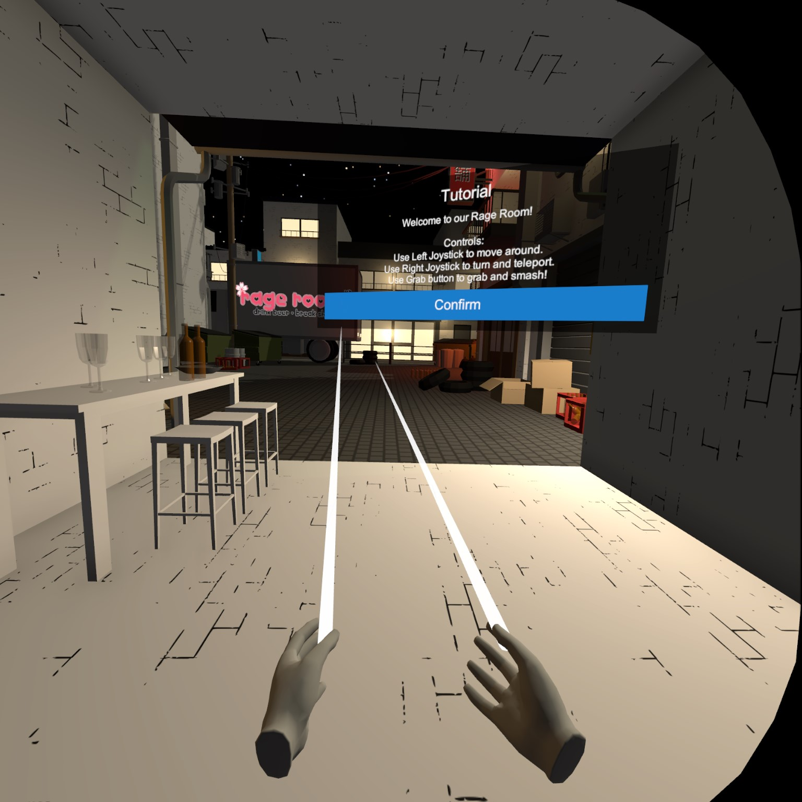
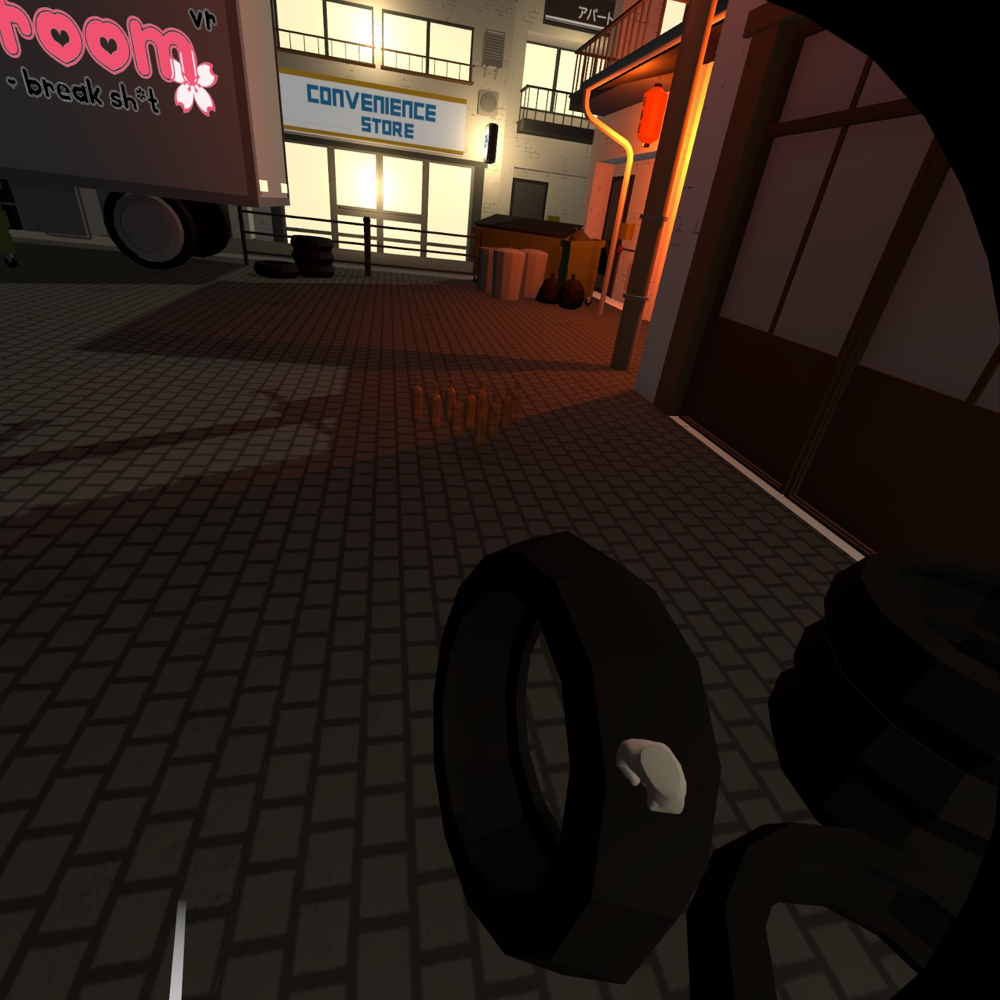
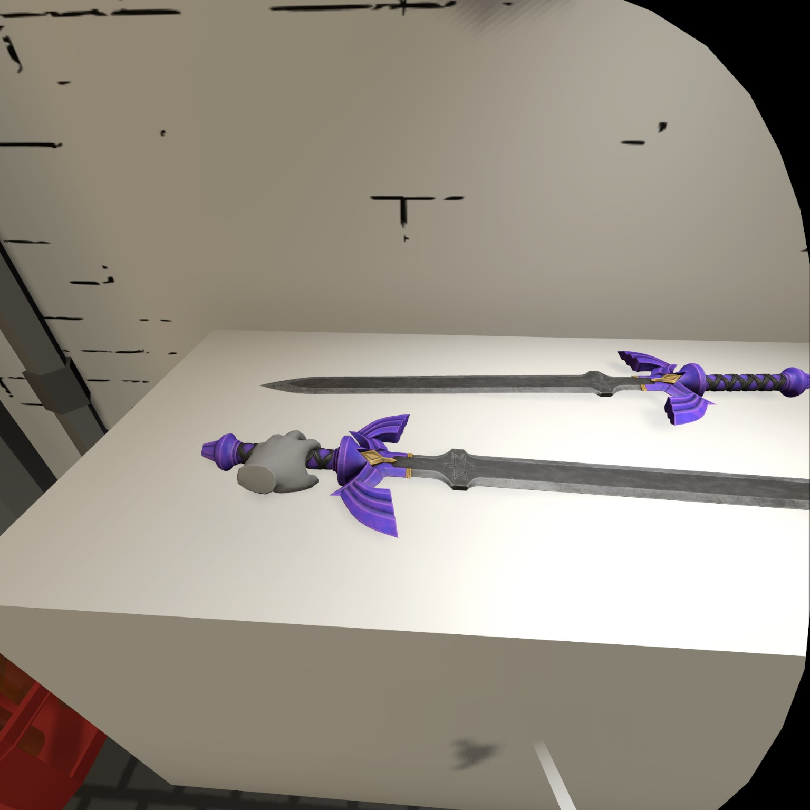
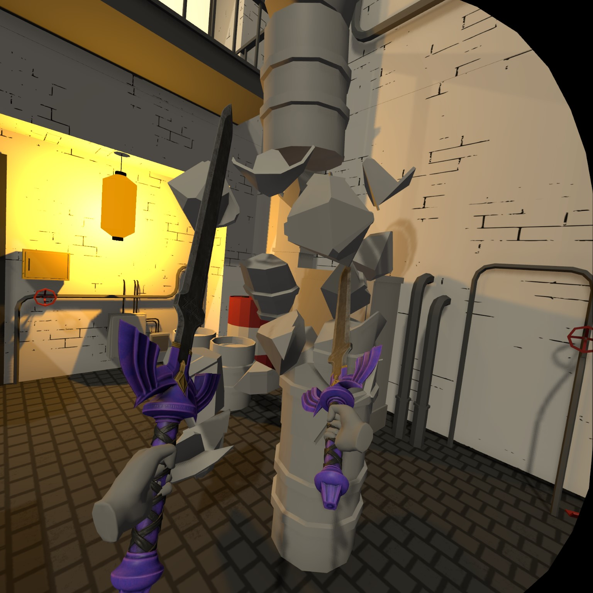
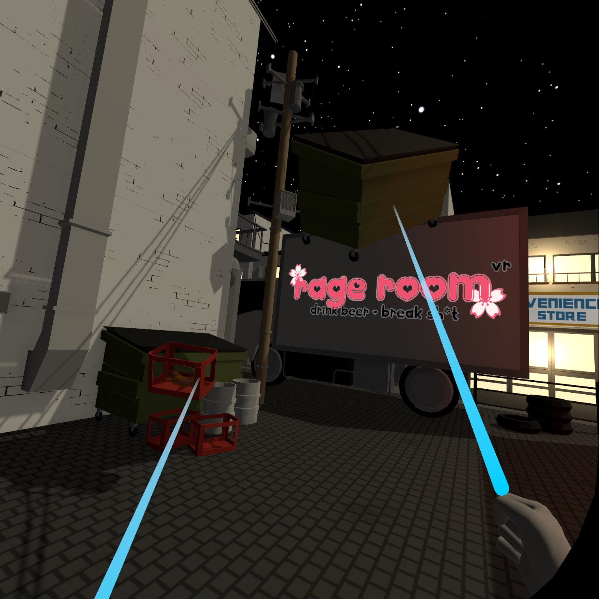

# CS490 VR Final Project Report

### Project: Rage Room in VR

### Members: Kabir Batra, Myky Huynh, Nick Gorki

## In Game Screenshots:

## Abstract:

The purpose of this project report is to outline the development of a virtual reality (VR) game that aims to recreate the experience of a rage room. The game allows users to destroy objects in a simulated environment, providing a convenient and accessible outlet for managing stress and negative emotions. This report provides an overview of the game's key features, development process, technical implementation, art and sound design, marketing and distribution plans, as well as the results and achievements obtained.

## Introduction:

Rage rooms, physical spaces where individuals can safely release their anger by breaking objects, are not easily accessible to everyone due to geographical and financial constraints. To address this issue, the objective of our project is to create a VR game that brings the experience of a rage room to a wider audience. By leveraging immersive technology, we aim to enhance mental health and well-being by providing a convenient and effective outlet for managing stress and negative emotions.

## Concept and Design:

For our game, we have chosen a Japanese back alley theme. The destructible objects in the environment include wine bottles, trash, cups, plates, and other items that fit the scene. We have also incorporated a vibrant night atmosphere with a starry skybox and aesthetic lighting from various lamps.

Here are some of our initial design inspirations:

From: Maarten Hof [https://maartenhof.artstation.com/projects/dOGYNK](https://maartenhof.artstation.com/projects/dOGYNK)

From: CNN [https://www.cnn.com/videos/travel/2019/06/03/rage-rooms-smash-rooms-travel-orig.cnn](https://www.cnn.com/videos/travel/2019/06/03/rage-rooms-smash-rooms-travel-orig.cnn)

## Development Process:

The development process involved two main objectives: VR interaction and physics, and scene design and props. These objectives were worked on simultaneously. For VR interaction and physics, we experimented with different frameworks and ultimately selected Unity's XR Interaction Toolkit for its ease of use and extensive tutorial base. We implemented interaction techniques such as hand-grab and distance-grab, locomotion techniques including translational and teleportation, and collision detection and shattering of objects. In terms of scene design and props, we conducted research on real rage rooms, created designs and sketches, sourced 3D assets, and used Blender to create shattered versions of objects.

## Technical Implementation:

In our final implementation, we utilized the XR Interaction Toolkit framework, built on OpenXR, within the Unity development environment. After considering various options, we chose Unity over Unreal Engine due to its user-friendly interface and extensive tutorial resources. During the implementation process, we encountered challenges while integrating object shattering mechanics. Many existing solutions were either time-consuming to implement or required significant computational power, which was not feasible on the Quest 2 hardware. To address this, we employed Blender's powerful "cell fracture" feature to pre-create shattered versions of objects. These fractured models were then dynamically swapped with the intact versions upon detecting collisions with a sufficiently high velocity. Additionally, we incorporated physics into the hands to enable realistic collisions with other objects. Since the hands needed to be kinematic and follow the controllers' positions instantly, we implemented a calculation to compute the instantaneous velocity of the hands. This calculation involved tracking the previous position of the hands every frame and calculating the difference in positions, which allowed for precise collisions between the hands and the virtual environment. These technical implementations greatly enhanced the overall realism and interactivity of the game.

## Art and Sound Design:

For the Japanese back alley scene, we obtained props and textures from a 3D asset package purchased from the Unity Asset Store. We designed a logo banner inspired by Japanese aesthetics. To enhance the nighttime ambiance, we added a starry skybox, adjusted the environment lighting, and incorporated various lights to create a cozy atmosphere. Sound design was limited within the given timeframe, but we plan to incorporate unique sounds for each object and additional audio elements like footsteps and the tumbling of objects to enhance immersion.

## Marketing and Distribution:

When exploring distribution platforms for our VR game, we carefully considered Steam, itch.io, and the Meta Quest Store. Steam stood out for its ability to offer a PC gaming experience with higher graphical settings and improved visuals. However, it's worth noting that Steam requires an initial fee for publishing games on their platform. Taking this into account, we also looked into itch.io as a compelling alternative. Itch.io offers greater flexibility in pricing and allows free uploads, making it an attractive option for us. Another option we considered was the Meta Quest Store, which solely supports native app usage on the Quest headset. This means we would need to optimize the game for the hardware limitations, potentially resulting in a trade-off with graphical quality and gameplay experience. As a result, our current plan is to initially publish the game on itch.io, with the intention of expanding to the Meta Quest Store once we strike the right balance between visual appeal and computational efficiency.

## Results and Achievements:

During our in-class demo, we presented the concept, enacted a potential use case through a skit, and showcased all implemented features within the scene. The audience responded positively, expressing interest in using the game for stress relief. Many are eagerly anticipating the game's launch to experience it firsthand.

## Conclusion:

Our VR game project successfully recreates the experience of a rage room in a virtual reality setting. By making it more accessible and affordable, we aim to contribute to enhancing mental health and well-being. The positive response we received during our demo further validates the potential of our game. We are excited about its future launch and the opportunity to provide users with a unique and engaging stress-relief experience.
